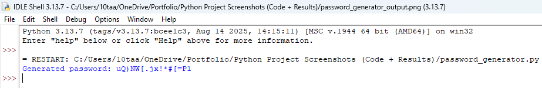

# Cybersecurity-portfolio
Cybersecurity and Python projects developed during my preparation for apprenticeship applications
# Taaha Nadeem – Cybersecurity Portfolio  

Welcome to my cybersecurity and programming portfolio.  
This repository showcases the projects, labs, and certifications I’m working on while preparing for a Cybersecurity Apprenticeship.  

---

## 🔹 Python Projects  
Practical coding projects that show my programming skills in action:  
- ### Password Generator  
**Description:**  
A Python script that generates strong, random passwords based on user-specified length and complexity.

**Tools Used:** Python, random module

**Key Skills Learned:**  
- Generating random passwords  
- User input handling  
- Writing clean, functional Python code
  
**Output Example:**  

- **Port Scanner** – Scans for open ports on a system to identify vulnerabilities.
- **Description:**  
A Python script that scans open TCP ports on a target IP in a safe lab environment.

**Tools Used:** Python, socket library

**Key Skills Learned:**  
- Network programming basics  
- TCP port scanning  
- Exception handling in Python

 **Output Example:**  
- **Website Uptime Checker** – Monitors if a site is online and responsive.  

---

## 🔹 Cybersecurity Home Lab  
Hands-on technical practice built on **VirtualBox** with **Kali Linux** and **Ubuntu VMs**:  
- Ran **Nmap scans** to explore networks.  
- Tested **firewall rules** and configurations.  
- Practiced **basic penetration testing** techniques.  

---

## 🔹 Certifications & Learning  
- **TryHackMe** – Intro to Cybersecurity Path (In Progress).  
- **freeCodeCamp** – Python Programming (In Progress).  
- **Future**: AWS Cloud Practitioner, CompTIA Security+.  

---

## 🔹 About Me  
I’m a college student studying **BTEC Level 3 Applied Science** at The Sixth Form Bolton (2024–2026).  
Passionate about technology, problem-solving, and ethical hacking.  
Currently applying for **Cybersecurity Apprenticeships 2025/26**, with Amazon as my #1 goal.  

---

Portfolio PDF: [bit.ly/3JP2px](https://bit.ly/3JP2pxe) 
📧 Contact: 10taaha.nadeem@gmail.com  07887584147
