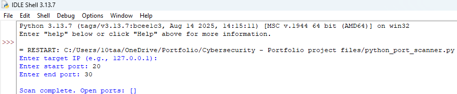
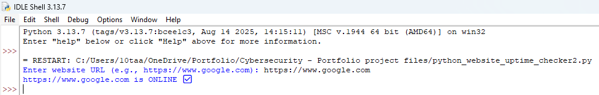
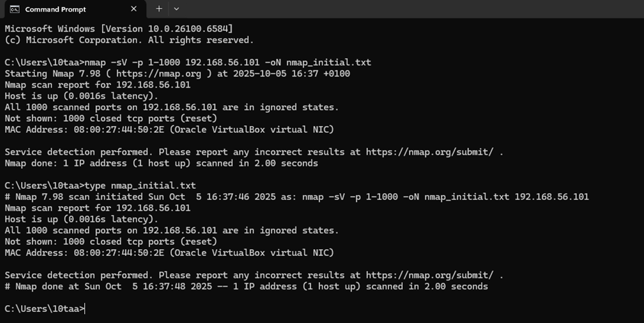
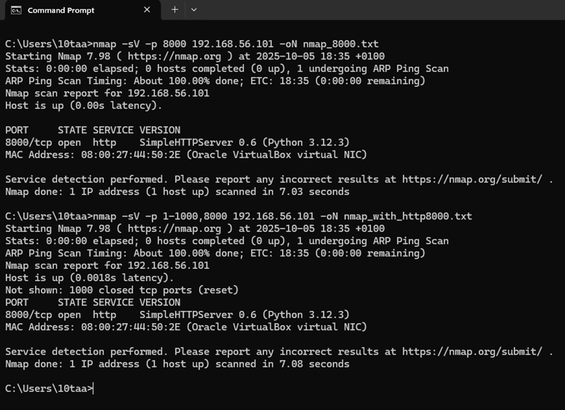
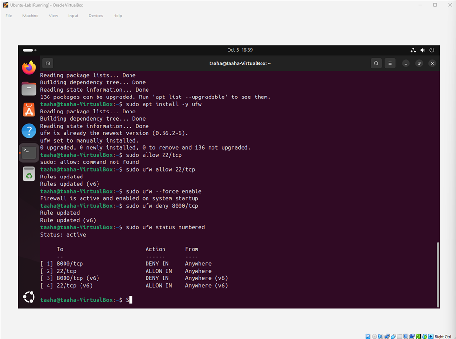
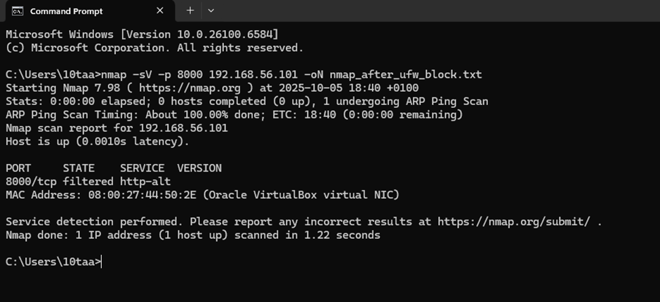

# Taaha Nadeem – Cybersecurity & Data Analysis Portfolio
  
I’m currently building projects in cybersecurity, data analysis, and Python automation while Preparing for Cybersecurity and Data Analyst Degree Apprenticeships.
My goal is to develop strong hands-on technical skills, understand how systems work under the hood, and use data and technology to solve real problems.

This portfolio includes the Python, data, and cybersecurity projects I’ve built, along with labs, certifications, and learning progress.

---

## 💻 Python & Data Projects

Practical coding projects that helped me learn programming, cybersecurity, and problem-solving skills.  
Each project was built from scratch to strengthen both my coding ability and understanding of security concepts.

---

### 🔑 Password Generator
**Description:**  
I created a Python script that generates strong, random passwords based on user input.  
It helped me practise using Python’s `random` and `string` modules.

**Tools Used:** Python, random, string  

**Key Skills Demonstrated:**
- Generating secure passwords programmatically  
- Using Python’s built-in modules  
- Writing simple, readable code
- Working with data inputs, randomisation, and producing structured output

**Screenshot:**  
  
→[View the code](./python-projects/password_generator.py)

---

### 🔍 Port Scanner
**Description:**  
I built a simple port scanner in Python that checks for open TCP ports on a target IP.  
I used threading to make it run faster and tested it safely within my home lab.

**Tools Used:** Python, socket, threading  

**Key Skills Demonstrated:**
- Understanding TCP port scanning  
- Working with sockets and multithreading  
- Safe testing in a lab environment
- Logging scan results and processing network data outputs

**Screenshot:**  

→[View the code](python-projects/port-scanner.py)

---

### 🌐 Website Uptime Checker
**Description:**  
This script monitors whether a website is online and responsive using Python’s `requests` module.  
It taught me how to handle HTTP requests and automate simple uptime monitoring tasks.

**Tools Used:** Python, requests  

**Key Skills Demonstrated:**
- Sending HTTP requests programmatically  
- Automating monitoring tasks  
- Handling and logging errors
- Collecting and interpreting simple status/response data
- Using Python to automate monitoring tasks similar to real operational analytics

**Screenshot:**  

→[View the code](python-projects/python_website_uptime_checker2.py)

---
## 📊 Beginner Data Analysis Excercises 
**Description:**  
Small Python tasks I completed to practise analysing simple datasets, organising information, and automating tasks.

Examples:

- Counting occurrences of items in a list (practising grouping data)
- Reading text files and extracting key information
- Filtering and sorting data using Python
- Working with dictionaries to map values
---
## 🧪 Cybersecurity Home Lab

My home lab simulates a small attacker-defender setup using **VirtualBox**, **Ubuntu**, and **Windows**.  
Through this project, I learned how to scan networks, identify open ports, host services, and secure systems with Linux firewall tools.
This project also helped me understand how system/network data appears in real environments and how to interpret scan results.

**Overview:**
- Used Nmap to scan and identify open ports  
- Deployed a Python HTTP server on Ubuntu  
- Configured and tested UFW (Uncomplicated Firewall) rules  
- Re-scanned with Nmap to confirm the system was secure  

→ [View the full Home Lab project →](home_lab/README.md)

**Screenshots:**  
- 
- 
- 
- 
---

## 📜 Certifications & Learning

- 🔐 **TryHackMe – Introduction to Cyber Security Path**
  Completed modules in networking, Linux, Python, and web fundamentals.
  → [View badges and progress screenshots](./tryhackme/)

- 🐍 **SoloLearn – Introduction to Python** 
  Improved my Python and helped me practise data-handling basics.  
  → [View Certificate](./certifications/sololearn-intro-to-python.pdf)

- 💻 **CompTIA Security+** *(Planned for 2026 Degree Apprenticeship)*  
  Currently studying for it to strengthen my cybersecurity fundamentals.

- ☁️ **AWS Cloud Practitioner (Intro)** *(Planned 2026–27)*  
  Starting to learn how cloud environments work and how data flows in enterprise systems.

---

## 👤 About Me

I’m currently studying **BTEC Level 3 Applied Science** at **The Sixth Form Bolton (2024–2026)** and building a strong interest in both cybersecurity and data analysis.

Over the past few months, I’ve been creating Python projects, completing online labs, and learning how real systems work.
I’m preparing to apply for Cyber Security and Data Analyst Degree Apprenticeships starting in 2026, where I can grow my technical skills through real work experience.

I enjoy building tools, understanding how systems behave, and using data or security concepts to solve problems.

📩 **Contact:** [10taaha.nadeem@gmail.com](mailto:10taaha.nadeem@gmail.com) | 📱 07887 584147
