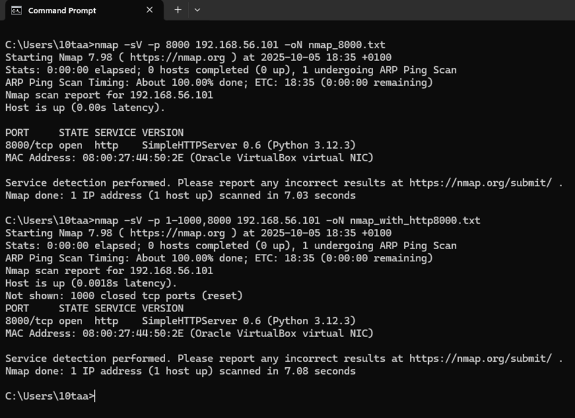

# Cybersecurity Home Lab — Nmap & Firewall Test

**Date:** 2025-10-05  
**Attacker:** Windows host (Nmap)  
**Target:** Ubuntu-Lab (Host-only IP: 192.168.56.101)

---

## 1️⃣ Initial Baseline Scan
**Command:**
`nmap -sV -p 1-1000 192.168.56.101 -oN nmap_initial.txt`

**Findings:**
- All ports closed — no active services found.

**Screenshot:**  

---

## 2️⃣ HTTP Server Detection
**Command:**
`nmap -sV -p 8000 192.168.56.101 -oN nmap_with_http8000.txt`

**Findings:**
- 8000/tcp open — SimpleHTTPServer 0.6 (Python 3.12.3)

**Screenshot:**  

---

---

## 🔹 3️⃣ Firewall Configuration (UFW)
Enabled and configured UFW on Ubuntu to block port 8000.

**Commands executed:**
`sudo ufw --force enable`
`sudo ufw deny 8000/tcp`

**Screenshot:**  

---

## 4️⃣ Verification Scan After Firewall
**Command:**
`nmap -sV -p 8000 192.168.56.101 -oN nmap_after_ufw_block.txt`

**Findings:**
- 8000/tcp filtered — port successfully blocked by UFW.

**Screenshot:**  

