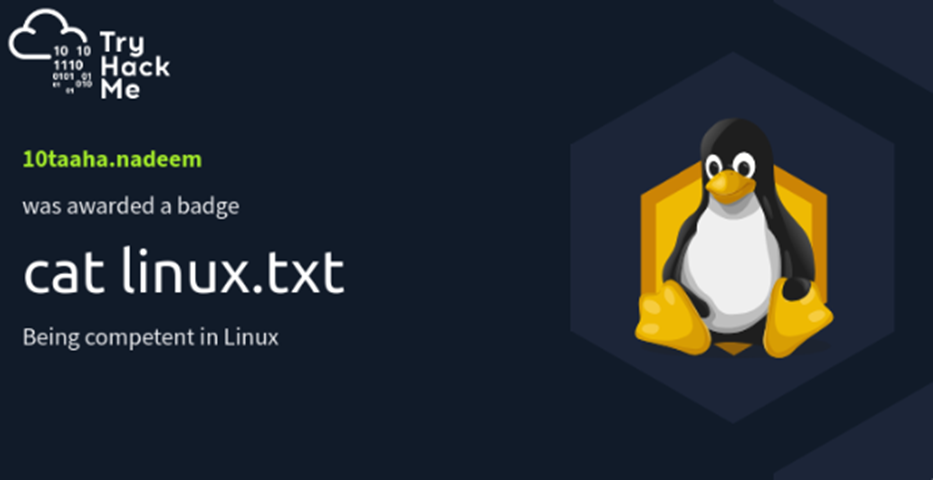
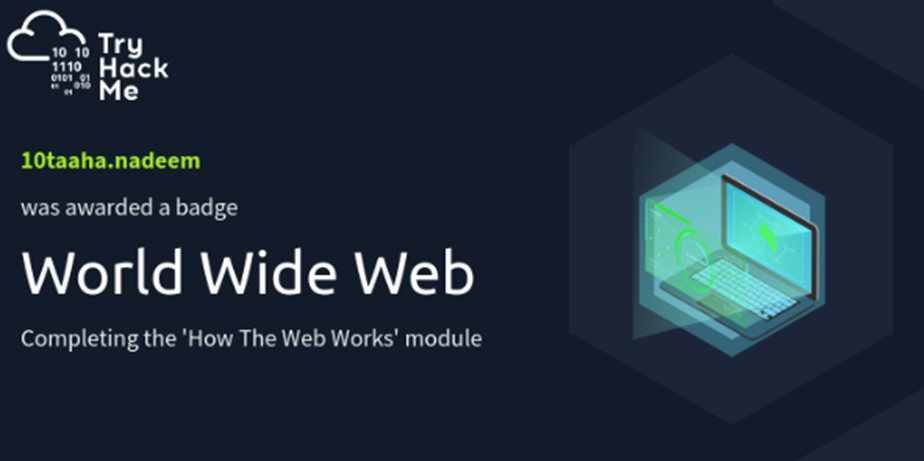
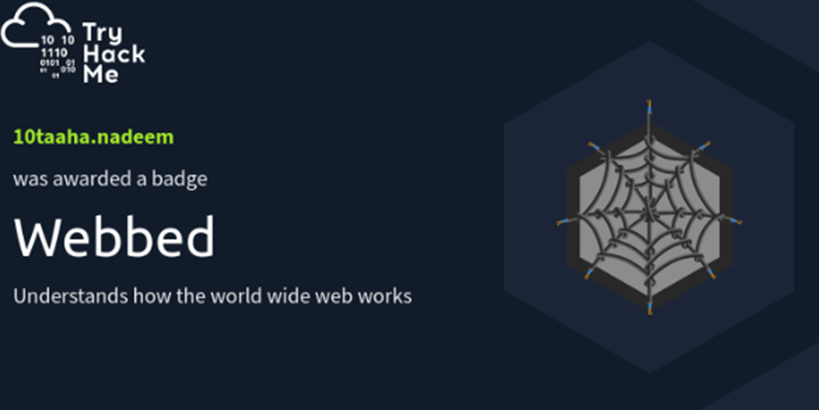
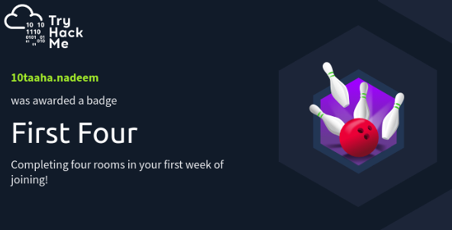
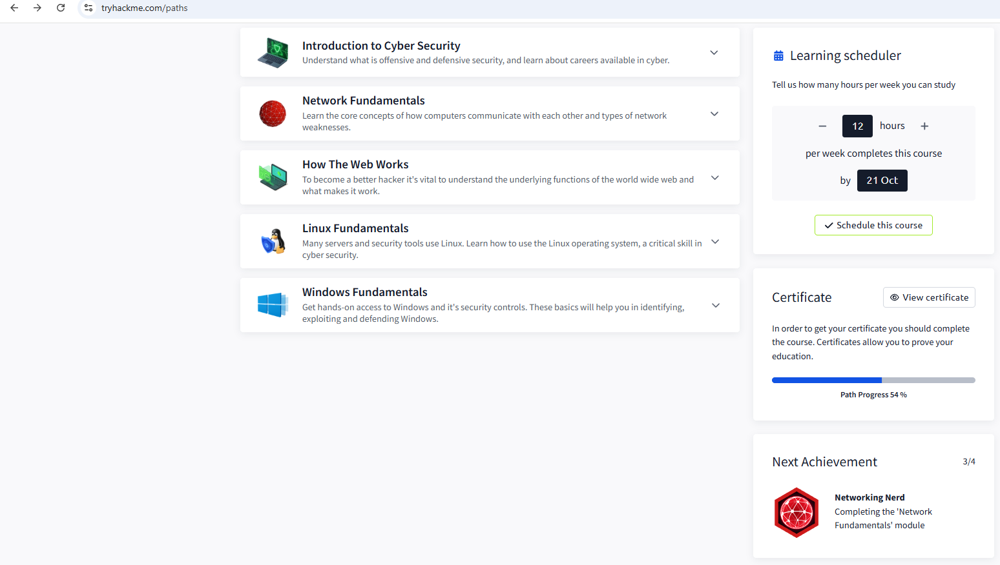

# TryHackMe – Introduction to Cyber Security Path

**Completion:** Core free modules completed – *October 2025*  
**Path progress:** 54% (premium sections remaining)

---

**Overview**  
This path taught me core defensive and offensive concepts through short, hands-on labs. I completed the free modules to build a practical foundation in networking, Linux, Windows and web fundamentals.

---

### Modules completed (summary)
| Module | What I learned |
|---|---|
| Introduction to Cyber Security | Basic cyber concepts, attack types, careers |
| Network Fundamentals (What is Networking?) | IP addresses, ports, and basic TCP/IP ideas |
| How The Web Works | HTTP/HTTPS, DNS and request/response cycles |
| Linux Fundamentals (Part 1) | Basic terminal commands, file system navigation |
| Windows Fundamentals (1–3) | Windows structure, user accounts, event logs |

---

## Badges Earned 
(Images and badges below show the badges i have earned, my TryHackMe progress and a screenshot of the path dashboard.)

*progress:* 

---

### Key skills developed
- Network fundamentals and TCP/IP basics  
- Linux and Windows system basics (commands, users, logs)  
- Web application behaviour and HTTP request/response cycles  
- Familiarity with guided virtual labs and safe testing

### Next steps
- Continue with **TryHackMe SOC Level 1** early 2026 to get hands-on defensive skills.  
- Begin studying **CompTIA Security+** to solidify theory alongside my apprenticeship.  
- Start AWS Cloud Practitioner intro materials to understand cloud security basics.
