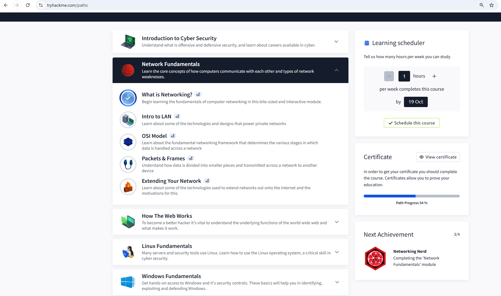

# TryHackMe – Introduction to Cyber Security Path

**Completion:** Core free modules completed – *October 2025*  
**Path progress:** 54% (premium sections remaining)

---

## Overview
This path introduced me to key areas of cybersecurity through hands-on, guided labs.  
I completed all free modules within the Introduction to Cyber Security path and earned multiple badges demonstrating consistent learning and applied skills.

---

## Modules Completed
| Module | Completion | Key Topics Learned |
|---------|-------------|--------------------|
| **Introduction to Cyber Security** | ✅ | Cyber threats, attack types, and cybersecurity careers |
| **Network Fundamentals** *(What is Networking?)* | ✅ | IP addresses, ports, and basic networking concepts |
| **How The Web Works** | ✅ | HTTP/HTTPS, web requests, DNS, and server communication |
| **Linux Fundamentals (Part 1)** | ✅ | Terminal commands, file system navigation, permissions |
| **Windows Fundamentals (1–3)** | ✅ | Windows structure, user management, system tools, and event logs |

---

## Badges Earned

*See all progress:*  

---

## Key Skills Developed
- Network fundamentals and TCP/IP understanding  
- Linux and Windows system administration basics  
- Web application structure and request/response cycles  
- Cybersecurity principles: confidentiality, integrity, availability  
- Familiarity with virtual lab environments and ethical testing  

---

## Next Steps
- Continue studying toward **CompTIA Security+** to strengthen my theoretical cyber foundations.  
- Begin **TryHackMe SOC Level 1 Path** in early 2026 to gain hands-on defensive security skills.  
- Explore **AWS Cloud Practitioner** materials to understand cloud security principles, especially relevant for Amazon’s cybersecurity environment.

